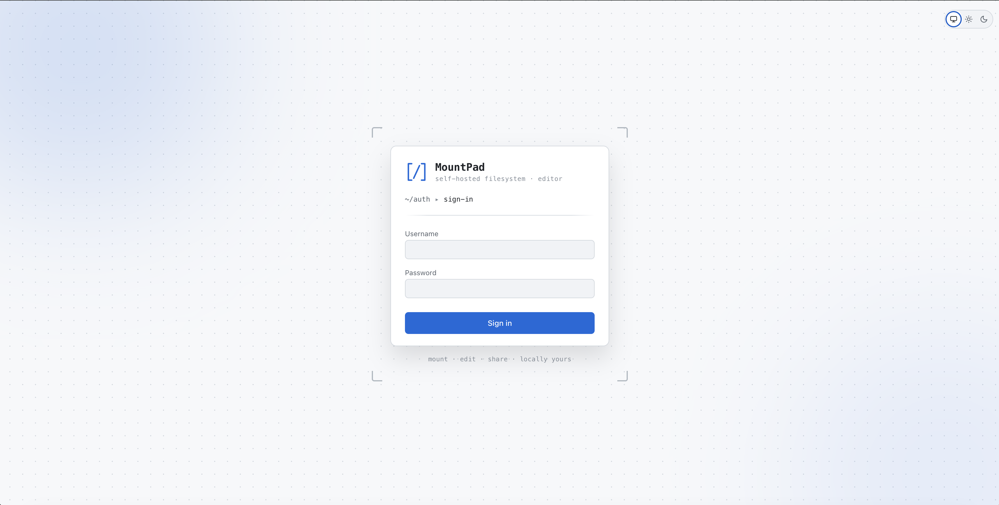
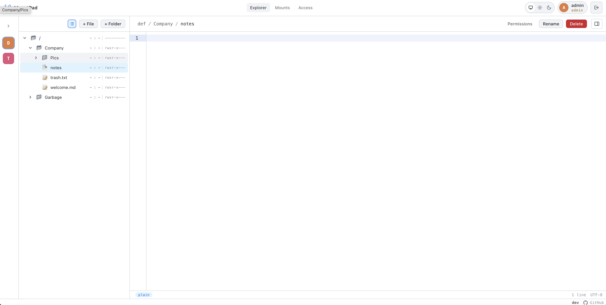

# MountPad

A small, self-hosted file station for your server.

Point it at a folder, sign in from the browser, and share access with the people you trust. That is the whole idea.

<table>
  <tr>
    <td width="50%" align="center">
      
      <br />
      <sub>Sign in</sub>
    </td>
    <td width="50%" align="center">
      
      <br />
      <sub>Workspace</sub>
    </td>
  </tr>
</table>

## Why

You have a server. You have files on it. You want to browse them, edit a config, drop in a backup, hand a folder to a teammate, without opening an SSH session and without shipping the data off to a third party.

MountPad is the little web app that sits on top of your storage and gives you exactly that, nothing more.

## What you get

- A clean file explorer in your browser
- A simple editor for text files
- Accounts, sessions, and per-folder permissions
- One container to run, SQLite by default, Postgres if you prefer
- Your files stay on your machine

## Mounts

You don't expose your whole disk in one block. Instead you carve it into **mounts**, which are just named entry points into a specific folder: `Backups`, `Family Photos`, `Project Alpha`, whatever fits.

Each mount has its own access rules. One can be read-only for everyone, another writable for two trusted accounts, another fully private. People only see the mounts they are allowed in, and the rest of the disk simply does not exist for them.

Add a mount, set who can do what, and move on.

## Getting started

Copy the example env file, set a session secret, start the container, open the app:

```bash
cp .env.example .env
# edit .env and set MOUNTPAD_SESSION_SECRET (e.g. `openssl rand -hex 32`)
docker compose up -d
```

Then visit `http://localhost:4499` and create the first account.

That brings up the production image on **SQLite**, with no extra services. Two host bind-mounts are created next to your `.env`:

- `${STORAGE_HOST_PATH}` → `/storage` - your mount points data (defaults to `./storage`).
- `${DATA_HOST_PATH}` → `/data` - the SQLite DB and any future app state (defaults to `./data`).

Keeping them separate means `/storage` stays purely for the files you expose, and a single backup of `/data` captures the app state regardless of which mounts are configured.

## Choosing the database

The engine is picked at runtime via the `DB_ENGINE` variable in your `.env`. There is only one Compose file - switching engines is a flag, not a different stack.

### SQLite (default)

Nothing to configure. The DB file path is `DB_FILE` (defaults to `/data/mountpad.db` inside the container, which lands inside the `DATA_HOST_PATH` bind-mount on the host).

```env
DB_ENGINE=sqlite
DB_FILE=/data/mountpad.db
```

### PostgreSQL

Set `DB_ENGINE=postgres`, fill in the connection details, and bring the stack up with the `postgres` profile so the bundled Postgres service starts alongside the app:

```env
DB_ENGINE=postgres
DB_HOST=postgres       # service name in docker-compose.yml; point elsewhere for an external cluster
DB_PORT=5432
DB_USER=mountpad
DB_PASSWORD=please-change-me
DB_NAME=mountpad
DB_SSLMODE=disable
```

```bash
docker compose --profile postgres up -d
```

The same `DB_USER` / `DB_PASSWORD` / `DB_NAME` values are reused to initialise the bundled Postgres container, so there's only one source of truth.

Need an exotic DSN (e.g. unix socket, custom search_path)? Set `DB_DSN` and it wins over the decomposed variables.

## Updating

```bash
git pull
docker compose up -d --build         # SQLite
docker compose --profile postgres up -d --build   # Postgres
```

Migrations run automatically on startup.

## Have fun

That is the whole pitch.
